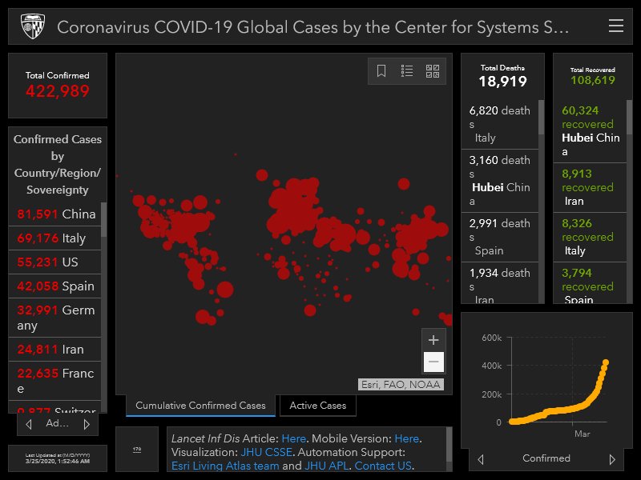
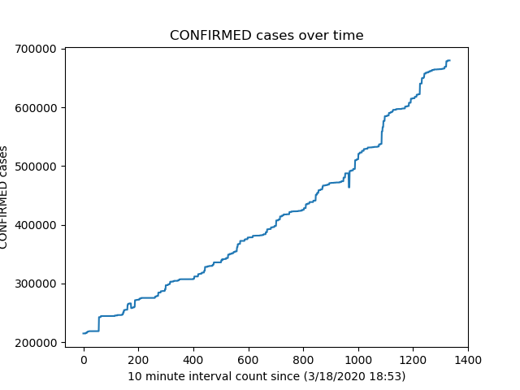
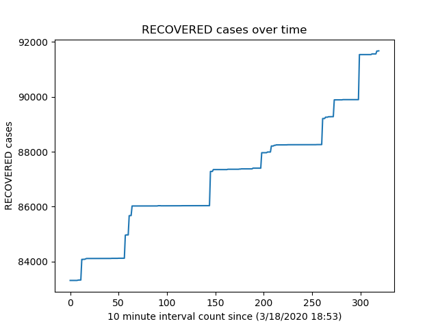
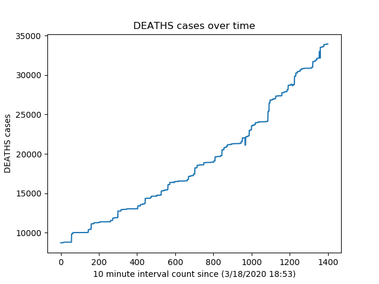
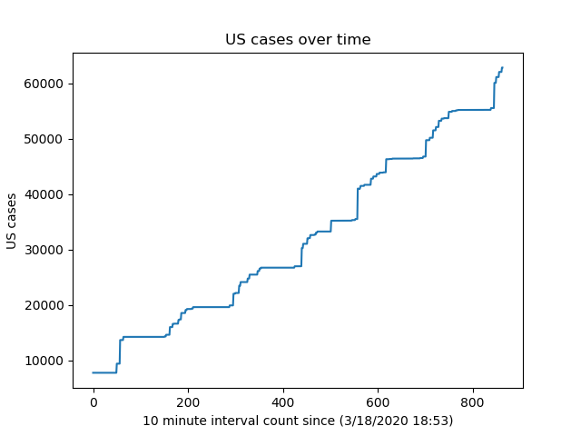
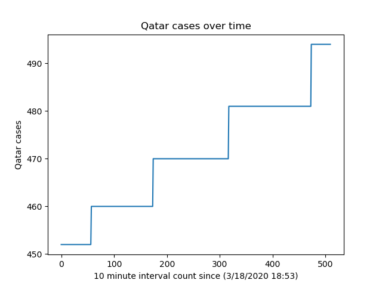

# Track-COVID
Automating the spread of COVID-19 by a 10-minute update crawler
#### This repository aims to collect the data involving the spread of COVID-19 in 10-minute intervals (cronjobs will update it hourly) and plot its growth accordingly.
##### Through this, we can further establish an ML model that predicts the spread of virus in a particular geolocation (to-do).
> Automatic Image Generation using in-built cronjob algorithms (node.js server, not in this repo currently). But plan to host it on a Raspberry Pi

#### Current status Screenshot from John Hopkins University

#### Current Confirmed Cases

#### Current Recovered Cases

#### Current Death Cases

#### Current U.S Cases

#### Current Qatar Cases

#### Data Source : <a href="https://www.arcgis.com/apps/opsdashboard/index.html#/85320e2ea5424dfaaa75ae62e5c06e61">John Hopkins University</a>
